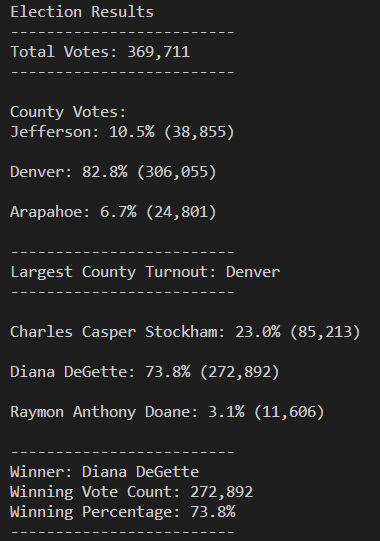

# Election Analysis

## Overview of Election Audit
The Colorado Board of Elections wanted us to create a Python script to find the following information:
- The total number of votes cast in this Congressional Districts election.
- A complete list of candidates who received votes in this election.
- The total number of votes each candidate received.
- The percentage of votes each candidate won.
- The winner of the election based on popular vote.

## Election Audit Results

- How many votes were cast in this congressional election?
  - 369,711 votes were cast. 
- Provide a breakdown of the number of votes and the percentage of total votes for each county in the precinct.
  - Jefferson County: 10.5% (38,855 votes)
  - Denver County: 82.8% (306,055 votes)
  - Arapahoe County: 6.7% (24,801 votes)
- Which county had the largest number of votes?
  - Denver County had the most votes/voters in this election.
- Provide a breakdown of the number of votes and the percentage of the total votes each candidate received.
  - Charles Casper Stockham: 23.0% (85,213 votes)
  - Diana DeGette: 73.8% (272,892 votes)
  - Raymon Anthony Doane: 3.1% (11,606 votes)
- Which candidate won the election, what was their vote count, and what was their percentage of the total votes?
  - Diana DeGette won with 272,892 votes, which was 73.8% of the total votes.

## Election Audit Summary

We audited a US Congressional District in Colorado, this code could be modified to automate the process in other Congressional Districts, Senatorial Districts, & other local elections.
Additionally, we could modify the Python script to also tabulate additional information like the number or percentage of voters from a specific political group or gender that voted for each candidate based on their Ballot ID from the election_results.csv file.